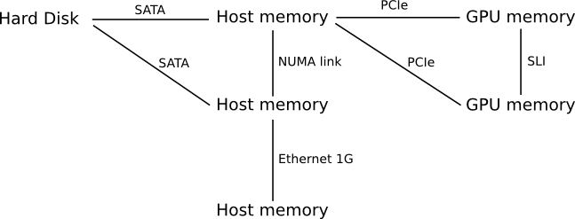
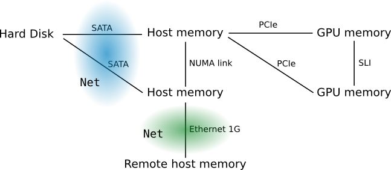
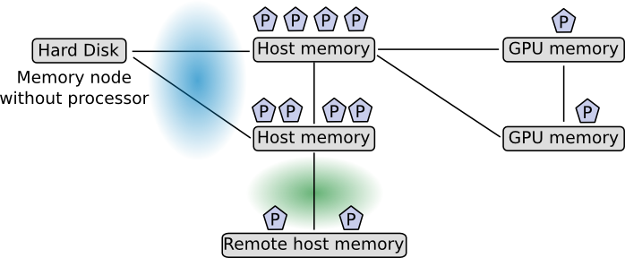

# Abstract architecture

## The big picture

Recent multi-core architectures are composed of several memory nodes
interconnected through networks with complex topologies. We can basically
represent them with a graph whose vertices are memory nodes (memories for
short) and edges are links between them. 

Some links between memory nodes share the same physical network. For instance a
bus or a physical link between two network cards. Hence, we add the notion of
network to our abstract architecture in order to know the kind of network we
deal with and how data transfers interact with each other.

To each memory node, we associate "processors" that are able to transform data
contained in memories they are attached to. Some memory nodes may not have any
processor attached (e.g. disks). What exactly a processor is depends on the
hardware. For instance some of them can be massively parallel (SIMD), some of
them can support interleaving of instructions from different flows
(simultaneous multithreading, SMT), etc.

## Representation

In ViperVM, this graph of memories is represented using shared transactional
memory so that nodes can be connected or disconnected. The basic data type is
`Host` which contains a set of host memories.

## Memories

TODO: peers, buffers, regions
